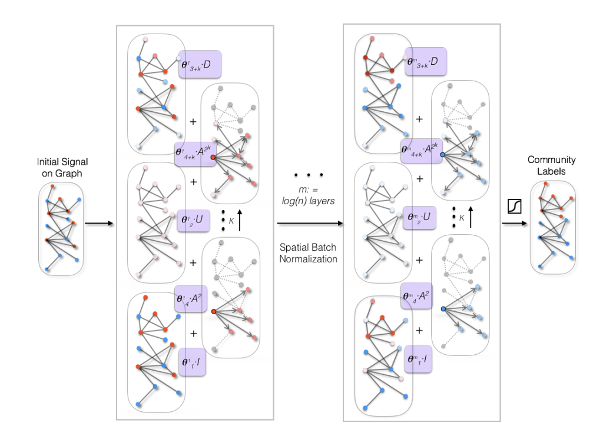

Multiscale Graph Neural Networks in PyTorch
====

PyTorch implementation of Community Detection with Graph Neural Networks [1].

For a high-level introduction to Graph Neural Networks, see:

Thomas Kipf, [Graph Convolutional Networks](http://tkipf.github.io/graph-convolutional-networks/) (2016)



Note: This code is based on the Lua implementation in https://github.com/joanbruna/GNN_community . This re-implementation serves as a proof of concept and is not intended for reproduction of the results reported in [1].

The experiments on real-world community detection are based on the Snap graphs with ground-truth community ([Stanford Network Analysis Project](http://snap.stanford.edu/)) [2].

## Installation

```python setup.py install```

## Requirements

  * PyTorch 0.2.0
  * Python 3.6

## Usage

``cd multiscalegnn``

```python snap.py --graph 'dblp' --data_dir './../data/'```

## References

[1][J. Bruna and L. Li, Community Detection with Graph Neural Networks, 2017.](https://arxiv.org/abs/1705.08415)

[2][Stanford Network Analysis Project.](http://snap.stanford.edu/)

